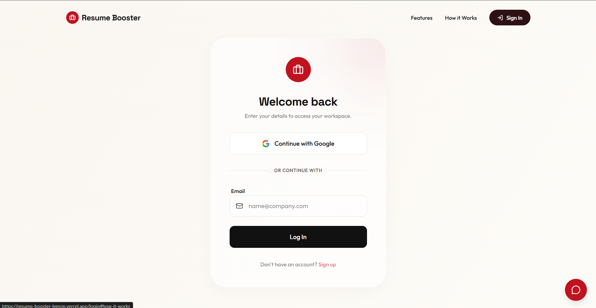
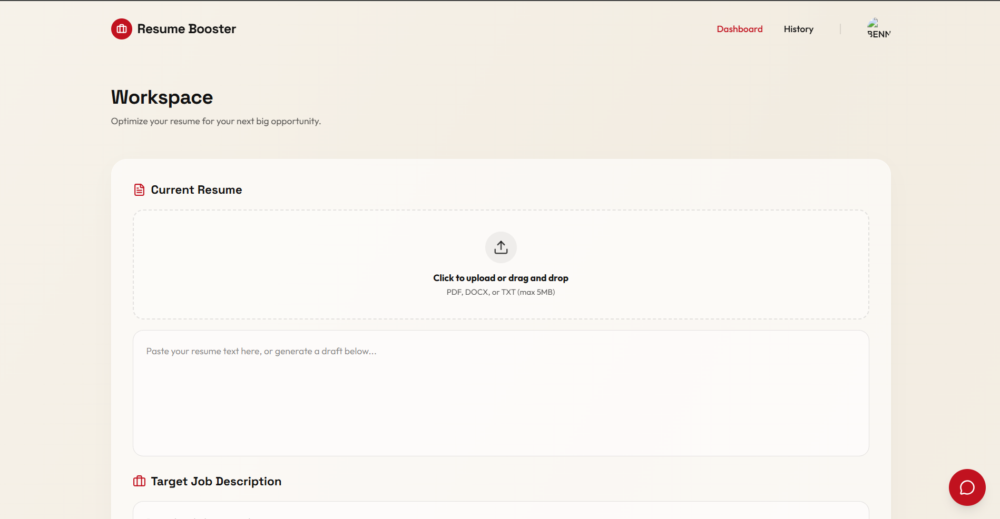
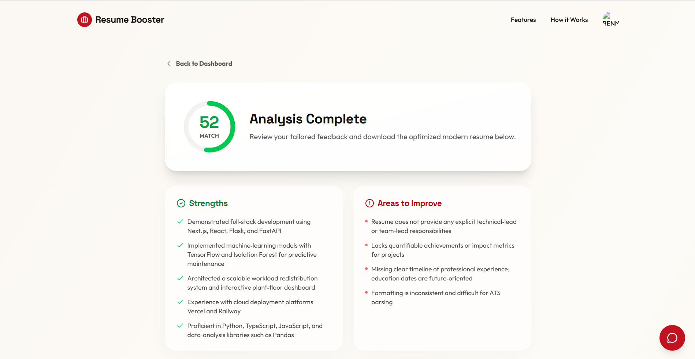
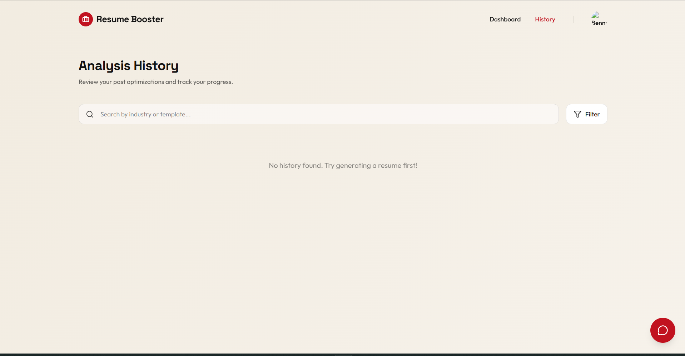

# Resume Booster

> **AI-powered resume optimizer** — paste your resume and a job description, get a match score, targeted feedback, and a rewritten resume in seconds.

🔗 **[Live Demo](https://your-live-demo-url.vercel.app)** &nbsp;|&nbsp; Built with Next.js, Groq AI, and MongoDB

---

## What It Does

Most job seekers send the same resume to every role and wonder why they don't hear back. Applicant Tracking Systems (ATS) filter resumes by keyword match before a human ever sees them, so a well-qualified candidate can be screened out simply because their resume uses the wrong words.

**Resume Booster** fixes this. You paste your current resume, the job description you're targeting, and your industry. The app sends both to a large-language model via the Groq API, which scores the match across four dimensions — keywords, skills, experience alignment, and structure — identifies missing skills and keywords, and rewrites the resume to better fit the role. You walk away with a scored analysis and a polished, tailored resume ready to download.

### Core Features

- **Resume match score** — a 0–100 score broken down by keywords (40 pts), skills (25 pts), experience (20 pts), and structure (15 pts)
- **Gap analysis** — lists missing required and preferred skills straight from the job description
- **Strengths & weaknesses** — plain-English bullet points on what's working and what isn't
- **AI-rewritten resume** — a complete rewrite optimized for the target role
- **AI resume builder** — no resume yet? Fill in a form and let the AI draft one from your info
- **Personalized suggestions** — prioritized, actionable steps to improve your application
- **Analysis history** — all past analyses saved to your account so you can revisit them
- **Google Sign-In** — one-click authentication, no password required

---

## Demo

### Video Walkthrough

<!-- Add your demo video here -->
https://github.com/user-attachments/assets/placeholder-replace-with-github-video-url

> 💡 _To embed the video: open this README on GitHub.com → Edit → drag `Resume Booster Demo.mp4` into the editor to get a hosted URL, then replace the line above._

### Screenshots

| Login | Dashboard |
|---|---|
|  |  |

| Analysis Results | History |
|---|---|
|  |  |

---

## How the AI Feature Works

Resume Booster uses the **Groq API** (running the `openai/gpt-oss-120b` model) to perform the analysis.

When you submit your resume and job description, the app constructs a structured prompt that instructs the model to:

1. Score the resume across four rubric dimensions and return a numeric value for each
2. Extract missing required and preferred skills directly from the job description
3. List specific strengths and weaknesses as short bullets
4. Produce a complete rewritten resume optimized for the role
5. Return actionable improvement suggestions ranked by impact

The response is returned as strict JSON. The server validates every field — if the model returns malformed output, the request fails gracefully with a clear error rather than silently passing bad data to the UI. This means the scores you see are always the model's actual judgment, not defaults.

---

## Running Locally

### Prerequisites

- [Node.js](https://nodejs.org/) v18 or later
- A [MongoDB Atlas](https://www.mongodb.com/cloud/atlas) cluster (free tier works)
- A [Groq](https://console.groq.com/) API key (free tier available)
- A [Google Cloud](https://console.cloud.google.com/) OAuth 2.0 client (for sign-in)

### Steps

```bash
# 1. Clone the repository
git clone https://github.com/your-username/ResumeBooster.git
cd ResumeBooster

# 2. Install dependencies
npm install

# 3. Add your environment variables (see below)
cp .env.example .env.local
# then fill in .env.local with your values

# 4. Start the development server
npm run dev
```

Open [http://localhost:3000](http://localhost:3000) in your browser.

### Environment Variables

Create a `.env.local` file in the project root with the following keys. **Never commit real values to version control.**

```env
# MongoDB Atlas — your database connection string
MONGODB_URI=your_mongodb_connection_string_here

# Groq — API key for the AI analysis and resume generation
GROQ_API_KEY=your_groq_api_key_here

# NextAuth — the public URL of your app and a random secret string
NEXTAUTH_URL=http://localhost:3000
NEXTAUTH_SECRET=a_long_random_secret_string

# Google OAuth — from your Google Cloud Console project
GOOGLE_CLIENT_ID=your_google_client_id_here
GOOGLE_CLIENT_SECRET=your_google_client_secret_here
```

---

## Tech Stack

| Layer | Technology |
|---|---|
| Framework | [Next.js 15](https://nextjs.org/) (App Router) |
| Language | TypeScript |
| AI / LLM | [Groq API](https://console.groq.com/) |
| Database | [MongoDB Atlas](https://www.mongodb.com/) via Mongoose |
| Auth | [NextAuth.js v5](https://authjs.dev/) — Google OAuth + JWT |
| Styling | Tailwind CSS v4 |
| Animations | Motion (Framer Motion) |
| Hosting | [Vercel](https://vercel.com/) |

---

## How to Use

1. **Sign in** with your Google account.
2. On the **Dashboard**, paste your current resume text (or upload a PDF/DOCX), then paste the job description you're targeting.
3. Select your industry and click **Generate Analysis**.
4. Review your **match score**, read the strengths, weaknesses, and missing keywords, and work through the AI suggestions.
5. Download the **rewritten resume** as a PDF or DOCX.
6. Visit **History** any time to revisit a past analysis.

---

## License

[MIT](LICENSE)
